<p align="center">
  
  
  
  
</p>

# 🏥 T-MOS: Transformer-Based Multi-Organ Segmentation in Laparoscopic Images

> **A comparative deep learning study for multi-organ semantic segmentation in laparoscopic surgical imagery, leveraging Swin Transformer architectures to achieve state-of-the-art performance on the Dresden Surgical Anatomy Dataset.**

---

## 📋 Table of Contents

- [Overview](#-overview)
- [Key Features](#-key-features)
- [Models Used](#-models-used)
- [Dataset Information](#-dataset-information)
- [Experimental Setup](#-experimental-setup)
- [Results](#-results)
- [Sample Outputs](#-sample-outputs)
- [Repository Structure](#-repository-structure)
- [Installation](#-installation)
- [Usage](#-usage)
- [Future Work](#-future-work)
- [Technologies Used](#-technologies-used)
- [License](#-license)
- [Acknowledgments](#-acknowledgments)

---

## 🔍 Overview

Laparoscopic surgery has emerged as the preferred approach for a range of abdominal procedures due to its minimally invasive nature, reduced patient trauma, and shorter recovery periods. However, the restricted field of view and 2D visualization inherent to laparoscopic video streams make it difficult for surgeons to identify and delineate anatomical structures in real time. **Multi-organ segmentation** — the task of assigning each pixel in an image to its corresponding organ class — addresses this gap by enabling automated anatomical understanding of surgical scenes.

This project investigates the effectiveness of **transformer-based architectures** for multi-organ segmentation in laparoscopic images, benchmarking them against established convolutional approaches. The work is motivated by several practical challenges that arise in the surgical domain:

- **Small-organ segmentation** — structures like the pancreas and spleen occupy very few pixels in a typical frame, making them easy to miss.
- **Visual interference** — surgical smoke, specular reflections, and variable lighting conditions degrade image quality.
- **Occlusion and deformation** — instruments and neighboring tissue frequently obscure organ boundaries.
- **Class imbalance** — background pixels vastly outnumber foreground organ pixels, biasing naïve training procedures.

By comparing CNN-based models (U-Net, DeepLabV3+) with transformer-based architectures (Swin U-Net, Swin UNETR), this study demonstrates that **vision transformers capture long-range spatial dependencies more effectively**, leading to improved segmentation masks — particularly for underrepresented and small-scale anatomical structures.

---

## ✨ Key Features

| Feature | Description |
|:--------|:------------|
| 🧠 **Multi-Organ Segmentation** | Simultaneous segmentation of 7 abdominal organs from a single laparoscopic frame |
| 🔄 **Transformer Architectures** | Leverages Swin Transformer backbones for global context modeling |
| 🎯 **Small-Organ Focus** | Weighted Dice-loss strategy to improve segmentation of pancreas, spleen, and small intestine |
| ⚖️ **Dice-Loss Weighting** | Combined Dice + BCE loss with class-level weighting to counteract severe class imbalance |
| 📊 **Comparative Analysis** | Head-to-head evaluation of 4 architectures under identical training conditions |
| 🗺️ **Unified Multi-Class Masks** | Merging of 7 individual organ annotations into a single 8-class segmentation map |
| 📈 **Quantitative + Qualitative Evaluation** | Per-organ Dice, IoU, Accuracy, Precision, Recall — alongside visual prediction overlays |

---

## 🧬 Models Used

### 1. U-Net (Baseline CNN)

The classic encoder-decoder architecture with skip connections. Trained with TensorFlow/Keras, it serves as the convolutional baseline. Strong at capturing local texture cues but limited in modeling global spatial relationships across the full surgical scene.

### 2. DeepLabV3+

An atrous-convolution-based architecture with a multi-scale feature extraction module (ASPP) and a refined decoder. Implemented in PyTorch, it provides a stronger CNN baseline with dilated receptive fields — but still relies on local convolution operations.

### 3. Swin U-Net ⭐ *(Best Overall)*

A **pure transformer** encoder-decoder built on hierarchical Swin Transformer blocks with shifted-window self-attention. It replaces all convolutional layers with transformer modules, enabling the network to reason over long-range dependencies at every scale. Achieved the **highest overall Dice score (0.8872)** and excelled at segmenting small organs.

### 4. Swin UNETR

Combines a **Swin Transformer encoder** with a CNN-based decoder connected via skip connections. This hybrid design preserves fine-grained local features from the convolutional decoder while benefiting from the transformer's global attention mechanism. Demonstrated **superior performance on large organs** and achieved a notably higher Dice for the pancreas on test data.

---

## 📂 Dataset Information

**Source:** [Dresden Surgical Anatomy Dataset (DSAD)](https://www.nature.com/articles/s41597-022-01719-2)

The DSAD is a publicly available, expert-annotated dataset of laparoscopic images capturing abdominal anatomy during minimally invasive procedures.

| Property | Detail |
|:---------|:-------|
| **Source folder used** | `multilabel` (multi-organ annotations per image) |
| **Total images** | 1,430 laparoscopic frames |
| **Total samples** | 2,860 (1,430 images + 1,430 corresponding multi-class masks) |
| **Number of classes** | 8 (7 organs + background) |
| **Image resolution** | Resized to **512 × 512** pixels |
| **Train / Val / Test split** | 80% / 15% / 5% |
| **Random seed** | 42 (for reproducibility) |

### 🏷️ Organ Classes

| Class ID | Organ | Color in Overlay |
|:--------:|:------|:-----------------|
| 0 | Background | — |
| 1 | Abdominal Wall | 🔴 Red |
| 2 | Colon | 🟢 Green |
| 3 | Liver | 🔵 Blue |
| 4 | Pancreas | 🟡 Yellow |
| 5 | Small Intestine | 🟣 Magenta |
| 6 | Spleen | 💧 Cyan |
| 7 | Stomach | 🟠 Orange |

### 🗺️ Multi-Class Mask Generation

The original dataset provides **individual binary masks** for each organ per image. Since segmentation models require a single mask input, all 7 organ masks are merged into **one unified multi-class segmentation map** where each pixel's value encodes its organ class (0–7). This merging is performed during preprocessing, yielding one image–mask pair per sample.

<p align="center">
  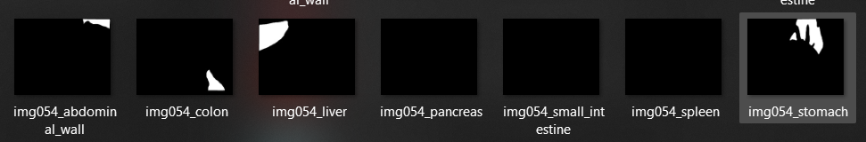
  <br>
  <em>Individual organ masks for a single laparoscopic frame (merged into one multi-class mask during preprocessing)</em>
</p>

---

## ⚙️ Experimental Setup

| Parameter | Value |
|:----------|:------|
| **Frameworks** | PyTorch (Swin U-Net, Swin UNETR, DeepLabV3+), TensorFlow/Keras (U-Net) |
| **GPU** | NVIDIA GPU (Google Colab / local) |
| **Input size** | 512 × 512 × 3 |
| **Loss function** | Dice Loss + Binary Cross-Entropy (combined) |
| **Optimizer** | AdamW |
| **Epochs** | 50–70 (with early stopping based on validation Dice) |
| **Batch size** | Configured per model based on GPU memory |
| **Data augmentation** | Albumentations — horizontal flip, vertical flip, rotation, brightness/contrast adjustment |
| **Early stopping** | Patience-based, monitoring validation loss / Dice |
| **Evaluation metrics** | Dice Coefficient, IoU (Jaccard), Pixel Accuracy, Precision, Recall |

---

## 📊 Results

### Overall Model Comparison

| Model | Mean Accuracy | Mean Precision | Mean Recall | Mean Dice | Mean IoU |
|:------|:------------:|:--------------:|:-----------:|:---------:|:--------:|
| **Swin U-Net** ⭐ | **0.9959** | 0.8770 | **0.8980** | **0.8872** | **0.8135** |
| **Swin UNETR** | 0.9955 | **0.8883** | 0.8487 | 0.8675 | 0.7856 |
| DeepLabV3+ | 0.9870 | 0.5678 | 0.8190 | 0.6431 | 0.5072 |
| U-Net (CNN) | 0.9046 | — | — | 0.9050 | — |

> ⭐ **Swin U-Net achieves the highest overall Dice (0.8872) and IoU (0.8135)**, establishing transformer-based segmentation as the superior approach for this task.

---

### Organ-Wise Dice Scores (Full Segmentation Evaluation)

| Organ | U-Net | DeepLabV3+ | Swin U-Net ⭐ | Swin UNETR |
|:------|:-----:|:----------:|:------------:|:----------:|
| Background | — | 0.968 | **0.985** | 0.983 |
| Abdominal Wall | — | 0.840 | **0.953** | 0.944 |
| Colon | — | 0.689 | **0.858** | 0.853 |
| Liver | — | 0.820 | **0.935** | 0.913 |
| Pancreas | — | 0.266 | **0.619** | 0.556 |
| Small Intestine | — | 0.448 | **0.963** | 0.947 |
| Spleen | — | 0.574 | **0.939** | 0.919 |
| Stomach | — | 0.864 | **0.943** | 0.940 |

---

### Test Set — Presence-Aware Dice Scores

| Organ | DeepLabV3+ | Swin U-Net ⭐ | Swin UNETR |
|:------|:----------:|:------------:|:----------:|
| Background | 0.9495 | 0.9820 | **0.9812** |
| Abdominal Wall | 0.7778 | 0.9149 | **0.9474** |
| Colon | 0.6363 | 0.7857 | **0.8549** |
| Liver | 0.7144 | 0.8155 | **0.8994** |
| Pancreas | 0.5015 | 0.6349 | **0.7276** |
| Small Intestine | 0.9571 | **0.9608** | 0.9572 |
| Spleen | 0.8431 | **0.9248** | 0.8380 |
| Stomach | 0.8374 | 0.9002 | **0.9326** |

> 📌 **Key Insight:** Swin UNETR demonstrates stronger test-time performance on **large organs** (liver, abdominal wall, colon, stomach) while Swin U-Net excels at **small organs** (small intestine, spleen). Both transformer models significantly outperform the convolutional baselines.

---

## 🖼️ Sample Outputs

### Swin U-Net — Segmentation Predictions

<p align="center">
  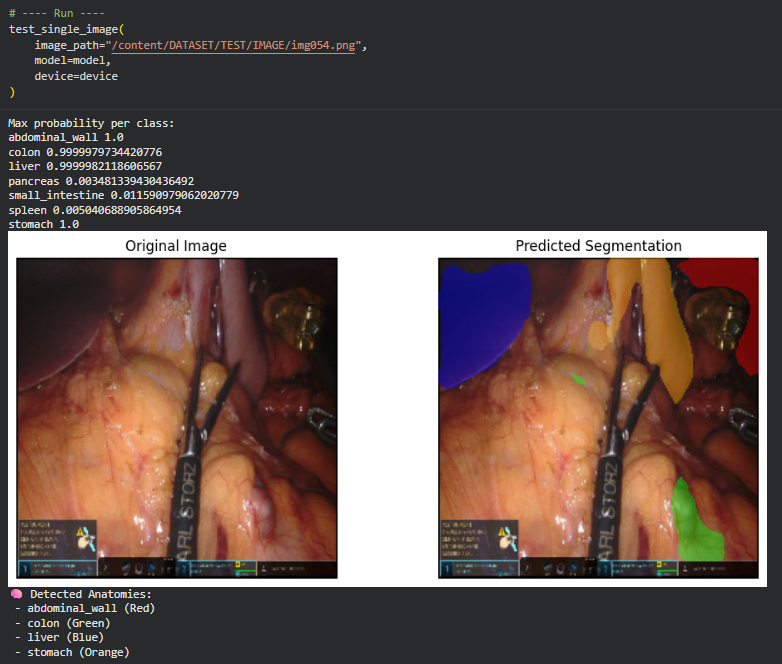
  <br>
  <em>Swin U-Net: Original image vs. predicted segmentation overlay with per-class probability scores</em>
</p>

<p align="center">
  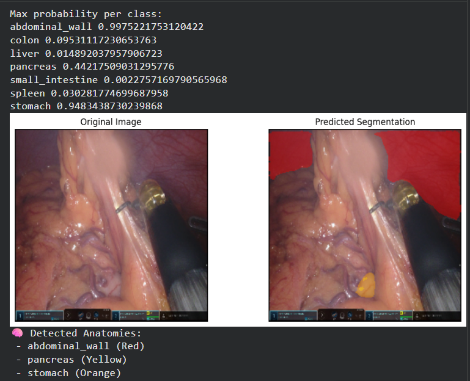
  <br>
  <em>Swin U-Net: Multi-organ detection including pancreas (Yellow) and stomach (Orange)</em>
</p>

---

### Swin UNETR — Segmentation Predictions

<p align="center">
  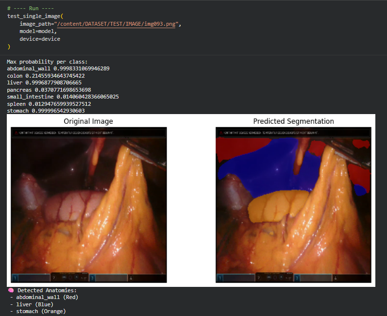
  <br>
  <em>Swin UNETR: Accurate large-organ segmentation — liver (Blue) and stomach (Orange) with high confidence</em>
</p>

<p align="center">
  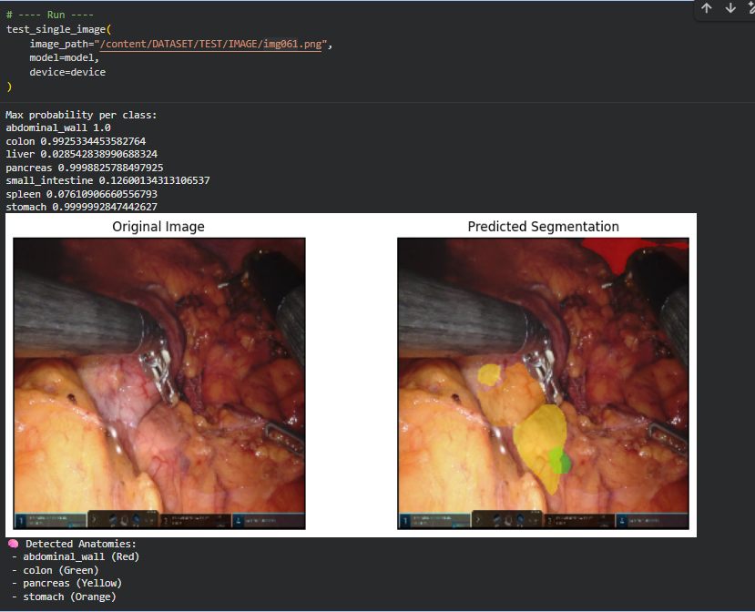
  <br>
  <em>Swin UNETR: Multi-organ detection with colon (Green) and pancreas (Yellow) delineation</em>
</p>

---

### Training Curves

<p align="center">
  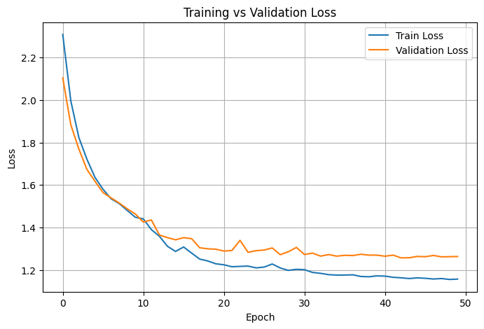
  <br>
  <em>Swin U-Net — Training vs. Validation Loss (smooth convergence over 50 epochs)</em>
</p>

<p align="center">
  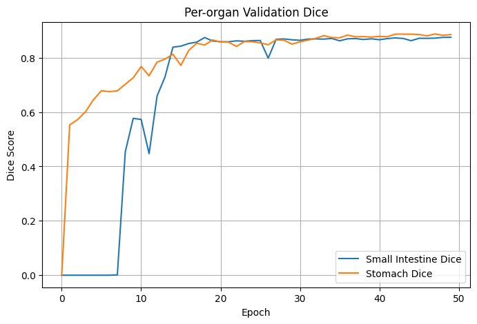
  <br>
  <em>Swin U-Net — Per-Organ Validation Dice (Small Intestine and Stomach tracked)</em>
</p>

<p align="center">
  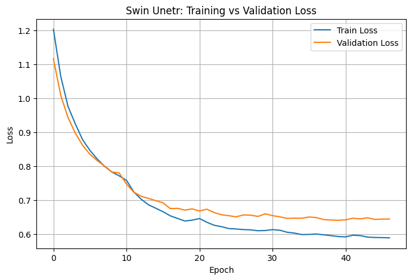
  <br>
  <em>Swin UNETR — Training vs. Validation Loss</em>
</p>

<p align="center">
  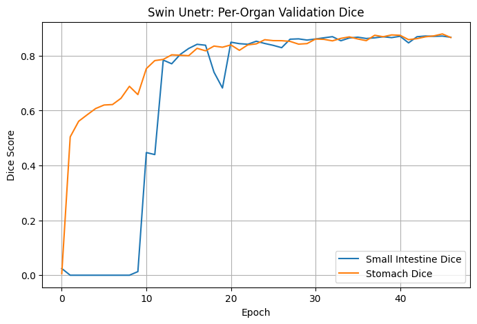
  <br>
  <em>Swin UNETR — Per-Organ Validation Dice</em>
</p>

---

### Evaluation Summaries

<p align="center">
  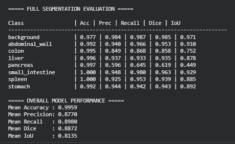
  <br>
  <em>Swin U-Net — Full Segmentation Evaluation on Test Set</em>
</p>

<p align="center">
  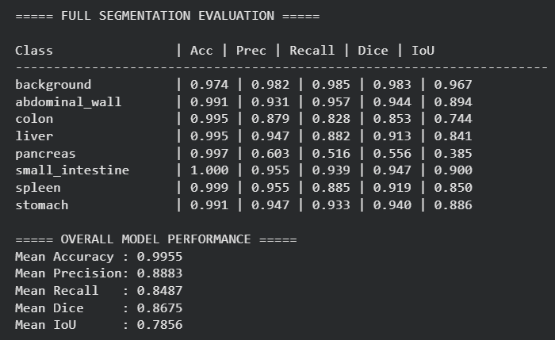
  <br>
  <em>Swin UNETR — Full Segmentation Evaluation on Test Set</em>
</p>

---

## 📁 Repository Structure

```
Transformer-based-Multi-Organ-Segmentation-Research/
│
├── 📓 notebooks/                        # Training and evaluation notebooks
│   ├── swin_unet.ipynb                  # Swin U-Net training pipeline
│   ├── swin_unter.ipynb                 # Swin UNETR training pipeline
│   └── deeplabv3.ipynb                  # DeepLabV3+ training pipeline
│
├── 🧠 models/                           # Saved model weights (git-ignored)
│   ├── best_swin_unet.pth              # Swin U-Net checkpoint
│   ├── best_swin_unetr.pth             # Swin UNETR checkpoint
│   ├── best_deeplabv3.pth              # DeepLabV3+ checkpoint
│   └── best_cnn_unet.h5                # U-Net (Keras) checkpoint
│
├── 📊 results/                           # Evaluation outputs per model
│   ├── swin_unet/                       # Swin U-Net results and visualizations
│   ├── swin_unetr/                      # Swin UNETR results and visualizations
│   ├── deeplabv3/                       # DeepLabV3+ results and visualizations
│   └── unet/                            # U-Net results and visualizations
│
├── 🔧 preprocessing/                    # Dataset preparation scripts
│   ├── dataset_generator.py             # Organize raw DSAD data into clean structure
│   ├── data_generator_all_model.py      # Merge masks and build train/val/test splits
│   ├── dataset_checker.py               # Validate dataset integrity
│   ├── count_valid_masks.py             # Count valid mask files
│   └── missing_check.py                 # Detect missing image-mask pairs
│
├── 🖼️ screenshots/                      # Key result screenshots for documentation
│   ├── swinunet1.png
│   ├── swinunet2.png
│   ├── swinunetr1.png
│   ├── swinunetr2.png
│   └── dataset_view.png
│
├── requirements.txt                     # Python dependencies
├── .gitignore                           # Excludes model weight files
└── README.md                            # This file
```

---

## 🚀 Installation

### Prerequisites

- Python 3.8 or higher
- CUDA-capable GPU (recommended for training)
- pip package manager

### Setup

```bash
# Clone the repository
git clone https://github.com/<your-username>/Transformer-based-Multi-Organ-Segmentation-Research.git
cd Transformer-based-Multi-Organ-Segmentation-Research

# Create a virtual environment (recommended)
python -m venv venv
source venv/bin/activate        # Linux / macOS
venv\Scripts\activate           # Windows

# Install dependencies
pip install -r requirements.txt
```

---

## 💻 Usage

### 1. Data Preprocessing

Prepare the Dresden Surgical Anatomy Dataset by organizing and merging organ masks:

```bash
# Step 1: Just make cleaner version of whole dataset.
python preprocessing/dataset_generator.py

# We only required multilabel folder to train our models.

# Step 2: Check that properly cleaner version of dataset is created or not..
python preprocessing/missing_check.py

# Step 3: Check that properly cleaner version of dataset is has all 7 masks for each original image or not..
# total no of original image = 1430 and corresponding 7 masks = (1430 * 7)
python preprocessing/count_valid_masks.py

# Step 4: Merge individual organ masks into multi-class masks and create train/val/test splits
python preprocessing/data_generator_all_model.py

# Step 5: Check that each image has its multiclass mask image or not 
# total no of original image = 1430 and corresponding muliticlass masks = 1430
python preprocessing/dataset_checker.py
```

### 2. Training

Open the relevant notebook in Jupyter or Google Colab and run all cells:

```bash
jupyter notebook notebooks/swin_unet.ipynb      # Train Swin U-Net
jupyter notebook notebooks/swin_unter.ipynb      # Train Swin UNETR
jupyter notebook notebooks/deeplabv3.ipynb       # Train DeepLabV3+
```

> **Note:** Training was conducted on Google Colab with GPU acceleration. Adjust batch sizes and paths as needed for your hardware configuration.

### 3. Evaluation

Each notebook includes dedicated evaluation cells that compute:
- Per-organ Dice, IoU, Accuracy, Precision, and Recall
- Presence-aware Dice scores on the test set
- Visual segmentation overlays on unseen test images

### 4. Single-Image Inference

```python
# Example: Run inference on a single test image (from notebook)
test_single_image(
    image_path="path/to/test/image.png",
    model=model,
    device=device
)
```

---

## 🔮 Future Work

- **Real-time deployment** — Optimize model inference for integration into live surgical navigation systems
- **Multi-dataset validation** — Evaluate generalization across CholecSeg8k, AutoLaparo, and other laparoscopic benchmarks
- **Clinical validation** — Collaborate with surgical teams to assess in-OR utility and safety
- **Improved small-organ segmentation** — Explore attention-guided focal losses and boundary-aware modules for pancreas and spleen
- **3D volumetric extension** — Extend the pipeline to 3D CT/MRI volumes using Swin UNETR's native 3D capabilities
- **Knowledge distillation** — Compress transformer models into lightweight architectures suitable for edge deployment

---

## 🛠️ Technologies Used

<p align="center">
  
  
  
  
  
  
  
</p>

| Library | Purpose |
|:--------|:--------|
| **PyTorch** | Core deep learning framework for Swin U-Net, Swin UNETR, and DeepLabV3+ |
| **TensorFlow / Keras** | U-Net baseline training and evaluation |
| **timm** | Pre-trained Swin Transformer backbone weights |
| **Albumentations** | Fast, GPU-friendly image augmentation pipeline |
| **OpenCV** | Image I/O, resizing, and mask processing |
| **NumPy** | Array manipulation and mask merging |
| **Matplotlib** | Training curves, Dice plots, and result visualization |
| **Pillow** | Auxiliary image loading and conversion |

---

## 📄 License

This project is released under the [MIT License](LICENSE).

You are free to use, modify, and distribute this work for academic and research purposes. If you use this work in your research, please consider citing this repository.

---

## 🙏 Acknowledgments

- **[Dresden Surgical Anatomy Dataset (DSAD)](https://www.nature.com/articles/s41597-022-01719-2)** — Carstens et al. for providing high-quality, expert-annotated laparoscopic images that made this research possible.
- **[timm (PyTorch Image Models)](https://github.com/huggingface/pytorch-image-models)** — for pre-trained Swin Transformer weights.
- **[Albumentations](https://albumentations.ai/)** — for the efficient augmentation library.
- The open-source deep learning community for foundational architectures and training methodologies.

---

<p align="center">
  <strong>If you find this work useful, please ⭐ star this repository!</strong>
  <br><br>
  <em>Built with dedication for advancing computer-assisted surgical navigation.</em>
</p>